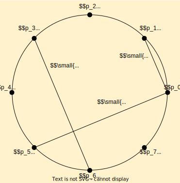
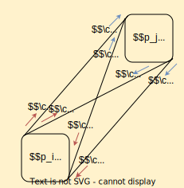

# String Art
This repository aims to reproduce the results of ["String Art: Towards Computational Fabrication of String Images"](https://www.geometrie.tuwien.ac.at/geom/ig/publications/stringart/stringart.pdf). The original [code](https://github.com/Exception1984/StringArt) was implemented in Matlab. This project implements the proposed algorithm in python and tries to make it more accessible. 

# Installation
The following setup assumes you are using miniconda on Ubuntu after you have cloned the repo
```
# current directory ~/string_art: 
conda create -n string_art
conda activate string_art
conda install pip
pip install -r requirements.txt
mkdir -p ~/miniconda3/envs/string_art/etc/conda/activate.d
echo 'export PYTHONPATH=/path/to/string_art' >> ~miniconda3/envs/string_art/etc/conda/activate.d/env_vars.sh
```

# Entities
The String art images are created by pulling a string around pins to approximate a target image as close as possible. To better understand the concepts and the accompanying code, this section introduces three key terms: `Pin`, `Edge`, and `String`:

`Pins` are numerated nodes that are positioned in a circle around the image. They are uniquely identified by their indices, forming an ordered list like `pins = [0, 1, 2, 3, ..., n_pins-1]`.

An `Edge` is a connection between two pins representing a straight line. In general graph networks, there is usually only one edge between two node. In our case however, we have to think about four different lines connecting the pins. This is because real pins have a width. To connect two pins we can either pull the string around the outside or diagonally and therefore get four possible `Connection Types`, namely `Straight In: 0, Straight Out: 1, Diagonal In: 2, Diagonal Out: 3`.
```python
pins = list(range(n_pins))
edges=np.repeat([(i, j) for i in pins for j in pins[i+1:]], 4, axis=0)
```

<div align='center'>  
    
</div>

Note, that instead of representing an edge by its start and end pin indices $(p_i, p_j)$ we can also just define and edge by its index $e_k$. Also note, that the connection types $3$ and $4$ can be always associated to one specific edge. To assign connection types $1$ and $2$ we need to know whether the edge is ingoing or outgoing. For `n_pins` pins there are `n_edges = 4*n_choose_k(n_pins, 2)` possible edges that can be drawn. 

`Strings` are obtained by actually drawing an edge onto an image. A `String` is a list of pixels with coordinates $(x,y)$ and a grayscale value $v$.
